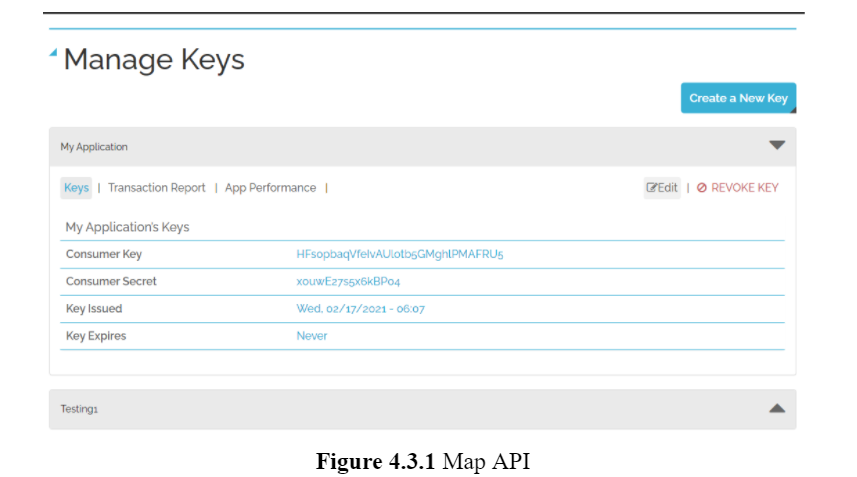

# Abstract

With the immense popularity of ride sharing services, more and more people use services like Uber. It is an online marketplace for riders and drivers. Normally a rider uses his smartphone app to request rides. Ride requests are assigned to a Uber driver, who uses his own vehicle to provide the ride. Low cost, short waiting time, availability as well as the convenience of simplified ride requests and easy payment are considered the main reasons of Uber’s popularity among the riders. On the other hand, the flexibility of work schedule, higher compensation rates and independence attract a lot of part time and full time drivers to contract with Uber. Students, professional drivers or people in-between jobs share their ride to earn some extra cash. As an independent worker, a driver would always want to fill the car with passengers to maximize profit. But it is not always easy to find a rider. Especially for a new driver in a new city. We analyzed Uber historic data in New York city and built a web application. Based on the holiday or workday and different times of the day, we suggest a location to the driver which is not very far away from the current location and has the higher probability of getting a ride.    

# Chapter 1: Introduction
## 1.1 Introduction
Now-a-days a large number of people use ridesharing services like Uber, Lyft. According to Uber, their service is available in 900 cities, across 93 countries. There are 103 million Uber monthly average users who are served by a total of 5 million drivers[1].

Uber, founded in 2009, is one of the most successful ridesharing companies. It is an online marketplace for riders and drivers. Normally. a rider uses his smartphone Uber app to request a ride. The ride requests are assigned to a specific Uber driver who uses his own vehicle to provide the ride. Low cost, short waiting time, availability as well as the convenience of simplified ride requests and easy payment are the main reasons contributing to Uber’s popularity among the riders. On the other hand, the flexibility of work schedule, higher compensation rates and independence are among the main reasons making Uber popular with drivers.

Independence of work attracts a lot of part time and full time drivers to contract with Uber. Students, professional drivers or people in-between jobs share their ride to earn some extra cash. As an independent worker, a driver would always want to fill the car with passengers to maximize profit.  But it is not always easy to find a rider. Especially for a new driver in a new city. We analyzed Uber historic data in New York city and built a web application. We suggest a place to the driver to be where he can find a rider.  

## 1.2 Motivation
A rider requests a ride using Uber App. A nearby Uber driver can accept the request and complete the ride. In order to accept the ride request a driver has to be in a certain radius of the rider when the rider requests the ride. If the driver is far away, he won’t be able to accept the ride request. And if a driver doesn’t get a request, he has to stay idle or roam around randomly. 

In our web application, based on Uber historic data we suggest an optimal location for the driver where:
1. It is highly likely to have a ride request.
2. Not very far away from the current location.
  

## 1.3 Methodology
### 1.3.1 Frontend
In the frontend we provide an interactive map. A user can click the map and set the clicked location as his current location. We also provide some forms to input other parameters like time of the day and holiday or workday.
In the output we provide the destination location where he should go to find a rider. We also provide a shortest path to reach the destination from the current location, time to reach the destination as well as  a guide to reach the destination. 

### 1.3.2 Backend
In the backend we train the model using Uber historic data. We used a clustering algorithm to train the model faster by reducing the total number of pickup locations. Also we used a spatial data structure to answer the user’s query faster.  

## 1.4 Contribution
We analyzed the Uber historic data and built a web application. Based on the data we recommend not only an optimal location but also provide a step by step guide on how to reach the destination in the shortest possible path. 

We used the K-means clustering algorithm to form ‘pickup stations’ with nearby pickup points. By that we have been able to reduce the pickup points to 10% and allowed us to work with a large set of data.

We used a spatial data structure R-tree[9]. It is used to quickly find the closest coordinates of a given coordinate.  Thus we have been able to process users’ queries faster.  

## 1.5  Outline
The remainder of the project report is organized as follows. In Chapter 2, we review the existing related works to this project work. Chapter 3 gives an overview of real dataset collection and processing. In Chapter 4 we illustrate the framework and the tools in detail that we have used. Chapter 5 describes our entire process of designing our web application. In Chapter 6, several snapshots and thorough guidelines of our web application are presented. Chapter 7 concludes the research work with future goals and directions.   

# Chapter 2: Related Works

**1. Uber Optimization: Finding Passengers Faster.**[2]
They recommend a destination for the driver based on the location, time of the day, day of the week and weather. They find all the pickup points in a quarter mile radius around the user's location. For each of those pickup points they calculate the score of the point by the number of other pickup points within a tenth of a mile radius. And the best score pickup point is selected as the destination.

**2. Uber/Lyft Maximization: More Money for The Time.**[3]
They transformed the pickup and dropoff coordinates into a heatmap using Leaflet plugin. They also added filters so that the user can manually select the days of the week and times for pick-ups or drop-offs. To give drivers a better idea they added a histogram on the sidebar to show the number of pick-ups and drop-offs on the users filtered criteria.

**3. Reinforcement Learning for Optimizing Driving Policies on Cruising Taxis Services.**[4]
To decrease waiting time of a cruising taxi driver, they simulated different decisions of the driver. For that, they built a Reinforcement Learning framework using dynamic programming. They formulated a Markov Decision Process on driver’s behavior considering the effect of driver’s action in the long run.   

**4. Optimizing Earnings for On-Demand Ride-Hailing.**[5]
Through a series of dynamic programming, they optimize a strategy for a ride-hailing driver to maximize the expected earning.

**5. Spatio-temporal feature fusion for Dynamic taxi route recommendation.**[6]
To decrease waiting time of a passenger and increase profit of drivers they recommend a dynamic taxi route to the drivers. First they use spatio-temporal features to measure the degree of easiness of a vacant taxi to pick up a new passenger. Second, to recommend the route effectively they design an adaptive deep reinforcement learning method to better fuse the extracted spatio-temporal features.

**6. A Cost-Effective Recommender System for Taxi Drivers.**[7]
They developed a cost-effective recommender system for taxi drivers. For this, they use a brute-force strategy to find the optimal route for recommendation. 

**7. Route Recommendations for Idle Taxi Drivers.**[8]
Their main goal is to minimize the distance between the taxi driver and the next anticipated passenger. To anticipate the next passenger, they used a Monte Carlo Tree Search and developed a route recommendation engine called MDM:Minimizing Distance. Simulation shows that the model is robust to anomalous events like concerts, sporting events, etc.   

# Chapter 3: Data

## 3.1 Data Collection
In 2015, by filing a Freedom of Information Law request the news and analytics website FiveThirtyEight obtained historical Uber data in New York City from the NYC Taxi & Limousine Commission. From this data set we used pickups from April, 2014 - September, 2014.[10] 
In this dataset we have GPS coordinates of the pickup location as well as time and date when the pickup happened.

We used another dataset from data.world[11] to verify if the corresponding pickup date was a holiday or not in New York City.  

## 3.2 Data Processing
We consider three attributes in our real dataset.
Location is a pair of float variables indicating the Latitude and Longitude. In our dataset Location is from where Uber picked up the passenger. In the output we also provide a location as the destination.
Hour is the time of the day when pick up has happened. We divide the day in 24 hours. So the Hour variable can take values between 0-23. We need Hour as a different attribute because depending on the hour of the day pickup frequency can differ.
Holiday is a boolean variable. True if the day is a holiday and false if not. Also depending on the holiday pickup frequency can differ. During the holiday people tend to stay awake late at night.

After cleaning and merging the data, we have a total of 4.5 million Uber pickup points in New York City. We chose a subset (around 3%) of the data randomly for our project.    

# Chapter 4: Frameworks and Tools
## 4.1 Python Libraries
### 4.1.1 Pandas
Pandas is an open source Python library for data analysis as well as in data science. The package is used for various data manipulation tasks. It includes a variety of techniques which is much easier working on data analysis related problems.

Features of pandas dataframe:
* Columns can be different types of data.
* Size can be altered.
* Rows and Columns are label based.
* Different types of arithmetic operations can be done.

Installation using pip: *pip install pandas* 

### 4.1.2 Scikit-learn
Scikit-learn is the most powerful Python library for machine learning. It is used for solving many machine learning and statistical modeling problems including classification, regression, clustering etc. in Python.

Pre-requisites:
* Python (Accessible for version >=3.5)
* NumPy (Accessible for version >=1.11.0)
* Scipy (Accessible for version >=0.17.0)
* Matplotlib (Accessible for version >= 1.5.1)
* Pandas (Accessible for version >= 0.18.0)

Scikit-learn provides including:
* Supervised learning algorithms (such as linear regression, support vector machine(SVM), decision tree etc.)
* Unsupervised learning algorithms (such as clustering etc.)
* Different kinds of Preprocessing such as Min-Max Normalization
* Reduce the number of features and create some new features (feature extraction)
* Select those features which are most relevant (feature selection)

Installation using pip: *pip install -U scikit-learn* 

### 4.1.3 Matplotlib
Matplotlib is a popular Python library which is used for data visualization including histograms, scatterplots etc. It mainly plots the dataset into 2-D visualization format. In January 2018, the latest version (2.2.0) was released.

Histogram plotting: The *matplotlib.pyplot.hist()* function draws a histogram including some computations.

Scatter-plotting: Scatter plots are used to plot data points on horizontal and vertical axis to visualize how data points look like.  

## 4.2 Django (Python Framework)
Django is a widely used and high level Python web framework which provides the MVT (model-templates-views) architecture pattern. It is a fully featured server-side framework and provides the full stack services as well. Simplicity, flexibility, reliability and scalability are the main goals of this web framework. 

### 4.2.1 Installing and Creating a Project
In order to install django, first we need to create a virtual environment. Because we don’t want to disturb our whole system.

After creating the virtual environment we can install django and start a new project.

 

### 4.2.2 Starting Web Server
Our created project will run on the local web server.

  

## 4.3 Mapquest API-key
We used Mapquest API-key to take input from the user and also output the destination as well as direction to the destination.

For ease of the users, customization of route experience is preferable including quickest driving time, shortest distance or approximate walking distance. In order to accomplish the task, we used *Optimized Route* function and it provides an optimal route.

Mapquest Plugin:

* Leaflet CSS file is included in header section:
    <xmp>
      <link rel="stylesheet" href="https://unpkg.com/leaflet@1.7.1/dist/leaflet.css"
      integrity="sha512-xodZBNTC5n17Xt2atTPuE1HxjVMSvLVW9ocqUKLsCC5CXdbqCmblAshOMAS6/keqq/sMZMZ19scR4PsZChSR7A==" crossorigin=""/>
   </xmp>

* After that, Leaflet JavaScript file is included:
    <!-- Make sure you put this AFTER Leaflet's CSS --> 
    

* A div tag is created for map:
    <xmp>

</xmp>

* Adding styles including the height of map:
    #map { height: 180px; }
